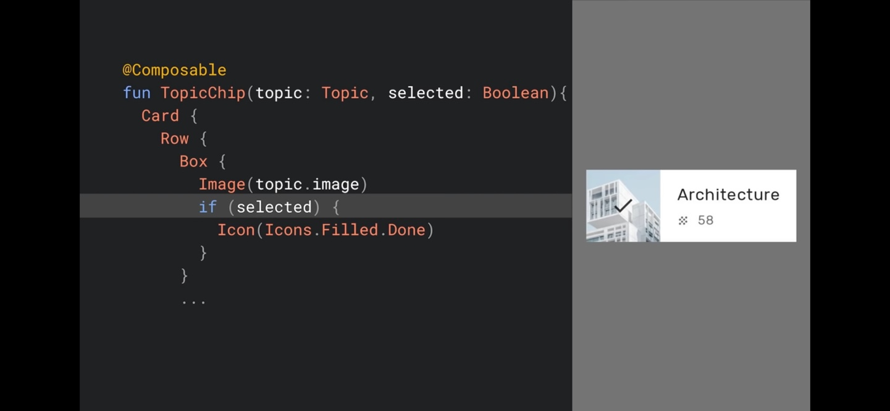

## Jetpack Compose

- `Jetpack Compose`는 Android의 최신 네이티브 UI 도구 키트이다.
  - **직관적**이고 **강력**하며 **더 적은 코드**로 UI를 작성할 수 있게 만든다.
  - UI에 들이는 시간을 아껴 기능 구현에 더 집중할 수 있다.
    - **개발을 빠르게 하도록 설계되었다.**

- View 기반 도구 키트는 10년 넘게 사용했다.
- 그 시간 동안 기술이 달라졌고 기기 성능이 좋아졌으며 앱에 대한 기대가 커졌다.
- UI는 훨씬 동적이고 다양하게 표현된다.
- **최신 아키텍처**를 기반으로 하고 **Kotlin**을 활용하는 도구 키트를 원한다는 의견이 많았다.

---

## Declarative

- **Jetpack Compose**는 `선언적` UI 도구 키트이다.

- 요즘 앱들은 **데이터가 동적이고 실시간으로 업데이트**된다.
- Android View를 사용하면 XML에 UI를 선언한다.
  - 데이터가 바뀌면 **View의 속성을 새롭게 설정**하여 UI도 업데이트를 해야 한다.
  - 애플리케이션의 상태가 바뀔 때마다 새로운 정보를 가지고 UI를 업데이트한다.
    - **굉장히 복잡한 과정이다.**

- Compose와 같은 선언적 UI는 `상태를 UI로 변환`한다.
- UI는 변경할 수 없고, 앱 상태가 바뀌면 **새로운 상태를 새로운 표현**으로 변환한다.
  - Compose는 **변경되지 않은 요소에 대한 작업**은 건너뛴다.
    - 개념적으로는 특정 상태에 맞춰 UI 전체를 새로 생성하는 것과 같다.
  - 코드는 `특정 상태에 대한 UI 형태`를 설명할 뿐이다.

- Compose에서 UI 구성 요소는 `@Composable` 주석이 달린 함수이다.
- **재사용** 가능한 요소로 구성된 라이브러리로 UI를 나누는 것이 좋다.
- Composable은 값을 반환하는 것이 아니라 **UI를 반환**한다.
  - Column, Text

- **Kotlin** 구문을 가지고 UI를 생성할 수 있다.
  - List가 비었을 때 Text를 보여주고 싶다면 `if`문을 사용할 수 있다.

- Composable은 **데이터**(messages)를 매개변수로 받아서 **UI**(Column, Text)를 전달한다.
  - messages 상태에 맞는 UI.
- **상태가 바뀔 때(다른 messages)** 이 함수를 실행하면 **새 UI**(다른 Column, 다른 Text)가 생성된다.
  - 이를 `Recomposing`이라고 한다.

- **ViewModel**의 **LiveData**이 변해서 **새 데이터가 관찰**될 때마다 **Composable**은  `recomposable`된다.
  - 직접 Observer 등을 설정하지 않아도 된다.
  - `Compose Compiler`가 **상태를 관찰하는 Composable**를 추적하여 상태가 변하면 자동으로 `recomposable`한다.
  - **변경된 Composable**에 대해서만 다시 실행하고 건너뛰기 때문에 효율적이다.

- 데이터는 매개변수로 Composable에 전달해야 하며, Composable을 **참조하거나 업데이트할 수 없다.**

- 위 CheckBox를 클릭해 보면 View에서와 달리 변화가 없는데 checked를 **상수 false**로 설정했기 때문이다.

- **상태를 바꾸고 싶다면 코드에 적용해야 한다.**
  - onCheckChange 안에서 **상태를 업데이트**한다.
- `선언적 UI의 핵심은 코드를 작성`해야 확인란을 눌렀을 때 선택된다는 것이다.
  - **요소는 전달되는 매개변수가 완전히 통제한다.**

- Composable을 **다시 실행하더라도 유지하고 싶은 변수**가 있다면 `remember`를 사용하라.
  - 값을 다시 사용해 재할당을 방지하거나 상태에 고정할 수 있다.

- **state**와 **update lambda**를 Composable의 매개변수로 전달하고 `단일 진실 공급원`으로 로직을 올릴 수 있다.

- 선언적 UI의 핵심은 **특정 상태에서 UI의 형태**를 완전히 `설명`한다.

- 상태가 바뀌면 **프레임워크**에서 `업데이트`를 처리한다.

- Compose는 **단방향 데이터 플로우**를 따르는 아키텍처와 잘 맞는다.
  - **ViewModel**이 화면 상태의 단일 스트림을 노출
  - **Compose UI**에서 관찰
  - 각 구성 요소의 **매개변수로 전달**

- 필요한 상태만 수신하기 때문에 **데이터를 바꿀 때만 업데이트**한다.
- **상태 변경을 한 곳에서 처리**하는 데 도움이 된다.
- **전체적 화면 상태**를 추론하고 오류를 낮추기 쉽다.
- **입력에 따라 완전히 제어**되기 때문에 Composable을 간단하게 테스트할 수 있다.

---

## UI Toolkit

- **Jetpack Compose**는 선언적 `UI 도구 키트`이다.

- **Material 디자인 구성 요소와 테마 시스템을 구현한다.**
  - Button, Card, FloatingActionButton, TopAppBar 등

- 모든 구성 요소는 기본적으로 **Material 스타일**을 따르고 **Material 테마**를 구현한다.
  - 브랜드에 맞게 체계적으로 **맞춤 설정**할 수 있다.
  - 원하는 `Colors`, `Typography`, `Shapes`을 **지정**할 수 있다.

- **새로운 레이아웃 시스템**은 행과 열이 기반이다.
- View와 달리 Compose 레이아웃 모델은 여러 measure를 전달할 수 없어서 **중첩된 레이아웃에 적합**하다.

- 새로운 Compose DSL을 적용한 **ConstraintLayout**을 사용하면 더욱 복잡한 레이아웃을 표현할 수 있다.

- **맞춤형 레이아웃도 훨씬 간단하게 구현**할 수 있어서 적절한 레이아웃을 만들고 싶다면 함수를 구현하기만 하면 된다.

- **새로운 애니메이션 시스템**은 훨씬 간단하고 보다 효과적으로 UI에 모션을 적용할 수 있다.

- Compose에서는 **테스트와 접근성**이 1급 객체이다.

- Compose는 테스트 기능을 극대화하는 전용 **테스트 아티팩트**를 제공한다.
- 독립적으로 Composable을 테스트하는 **간편한 API**를 제공한다.
- 애니메이션 코드를 테스트할 때도 테스트를 완전히 통제할 수 있다.

- **Kotlin** 기반으로 되어 있기 때문에 **코루틴을 사용하여 간단한 비동기식 API**를 작성할 수 있다.

- **Kotlin**은 UI 구성 요소를 **새로운 함수로 추출**해서 간단하게 재사용할 수 있다.

---

## Example

- topic을 **매개 변수**로 받는다.
- **Row**로 **Image**와 **Text**를 감싼다.
- **Card**로 **Row**를 감싼다.
- **Modifier**를 이용해 **Text**에 간격을 설정한다.

- 선택 여부를 위해 **Boolean**값을 매개변수로 받는다.
- **Box**로 **Image**와 **Icon**을 감싼다.
- if 문을 이용하여 선택 여부에 따라서 **Icon**을 표시하거나 하지 않는다.

- **radius**를 선택 여부에 따라서 값을 조정하고 **Card**에 전달한다.

- 애니메이션으로 바꾸려면 **animateAsState 함수**로 조건을 감싼다.

- **LazyColumn**을 사용하면 **RecyclerView**처럼 List를 표현할 수 있다.
  - List를 items에 전달하고 각 항목을 렌더링 하는 Composable을 전달한다.

- **Layout**을 이용해 코드 몇 줄로 **Grid**를 표현할 수 있다.

- **Compose**에서는 **다크 모드 테마**를 간편하게 설정할 수 있다.
  - 시스템이 **다크 모드**인지 검사하고 전환한다.
  - 모든 테마가 **런타임에 작동**하기 때문에 기본 테마 외에 동적 테마도 손쉽게 지원한다.

---

## Built for interop

- Compose는 View와 공존할 수 있어서 **점진적으로 도입**할 수 있다.

- **다른 주요 라이브러리와의 통합**을 제공한다.

- Compose는 웨어러블을 비롯한 소형 폼팩터에서 태블릿 등 **다양한 화면을 지원**한다.
